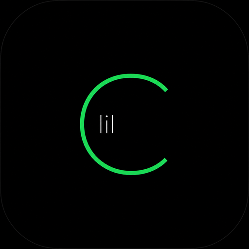
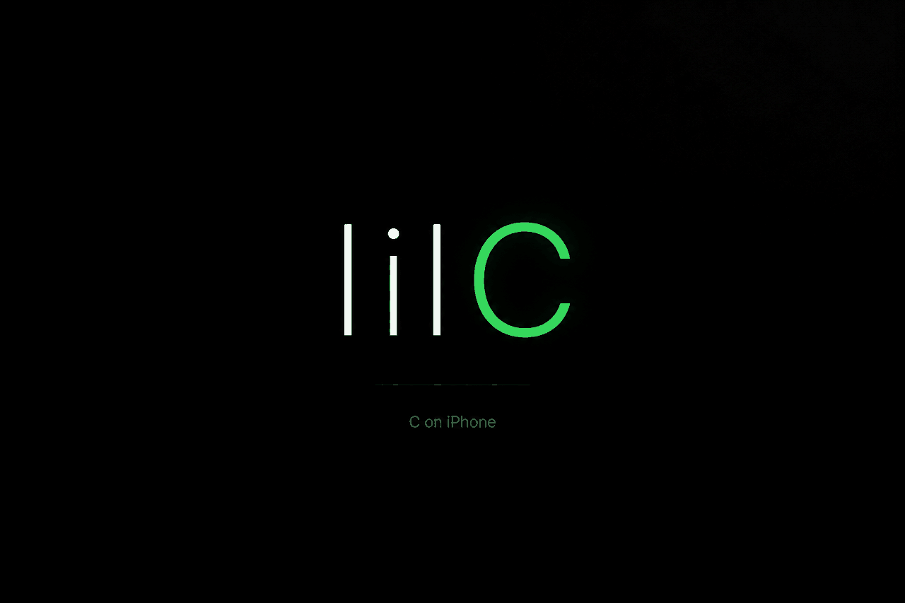
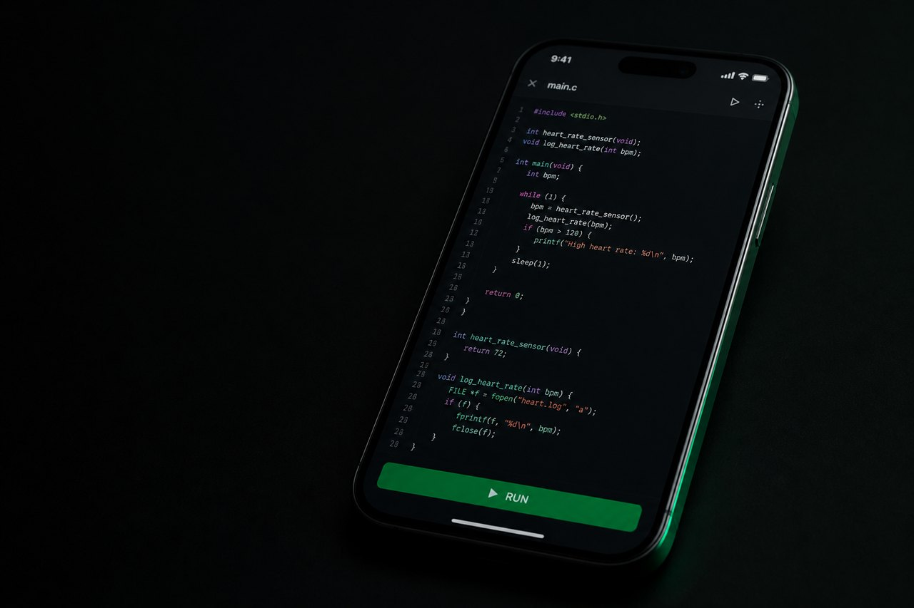
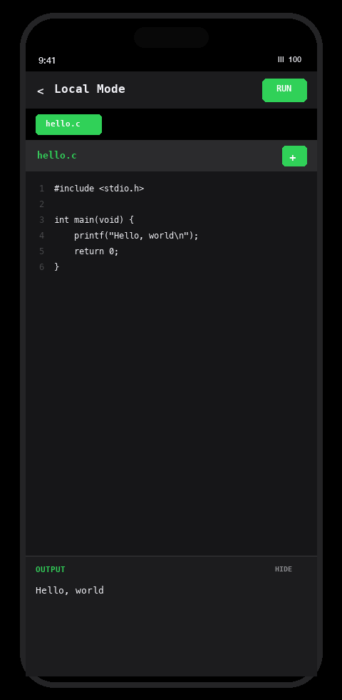
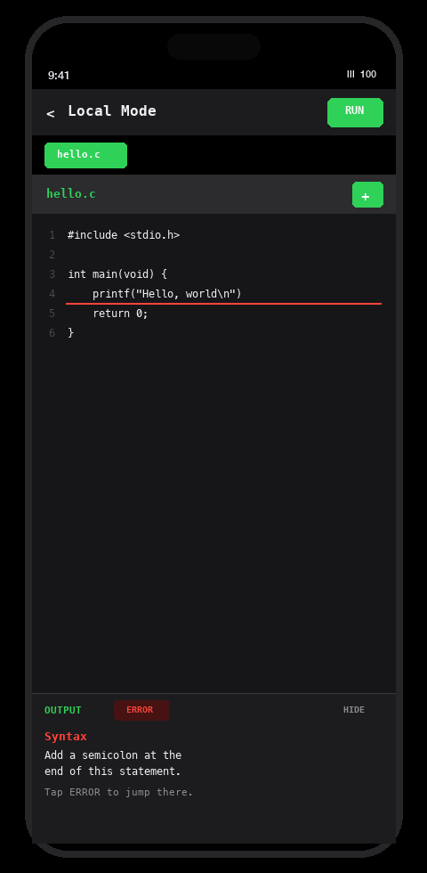
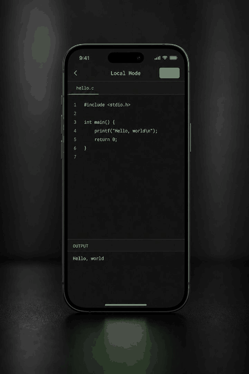
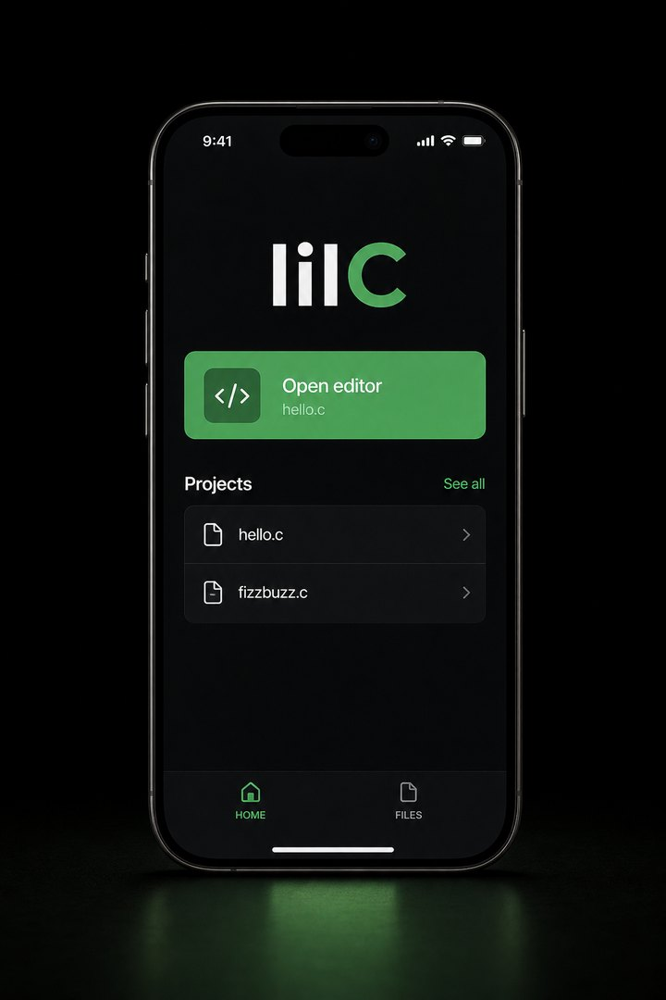
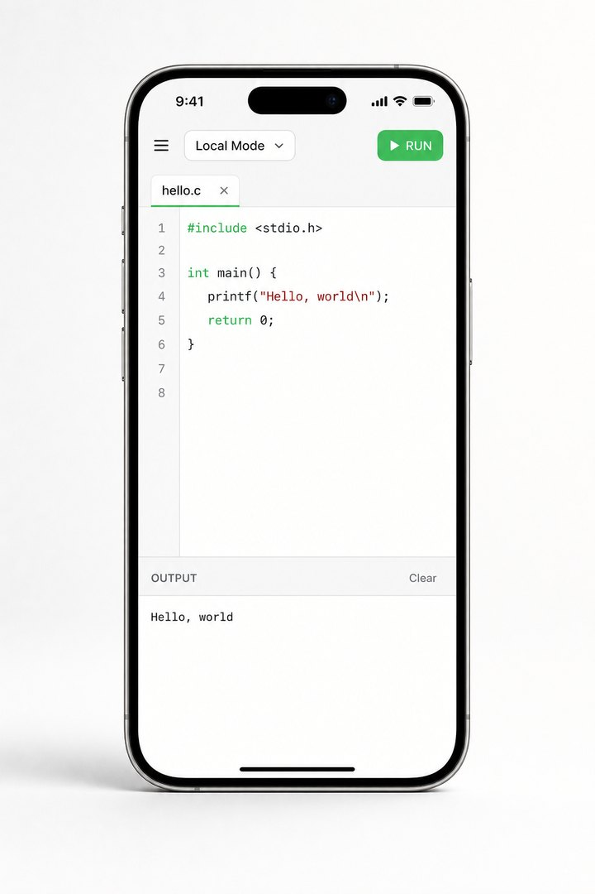

<p align="center">
  
</p>

<p align="center">
  
</p>

# lilC

**Learn C on iPhone.**

lilC is a free student resource. You write C in a native editor, press Run, and PicoC interprets the program on this iPhone. There is no remote Linux VM, no SSH session, and no cloud compiler.

This release does not include AI.

<p align="center">
  
</p>

## Write. Run. See.

<p align="center">
  
  &nbsp;&nbsp;
  
</p>

Open the editor, write a beginner C program, and press **RUN**. Output appears on the same screen. Find in file, a symbol keyboard, and jump to error are included. Files and projects stay on this iPhone. You can erase them from Home or from Settings.

## PicoC, honestly

The runtime is **PicoC**, a small interpreter (BSD 3-Clause, vendored in this repository). It is not GCC or Clang. Most beginner programs work. A full standard library, or extras only a desktop compiler supports, will not.

When a program fails, lilC shows a note written for learners. Tap **ERROR** to jump the caret to the line.

## Light and Dark

<p align="center">
  
</p>

Settings stores Light or Dark in UserDefaults. The chrome is spare on purpose: black or paper, one green accent, readable type.

<p align="center">
  
  &nbsp;&nbsp;
  
</p>

## Open in Xcode

1. Clone this repository.
2. Open `lilC.xcodeproj` (Xcode 16 or later, iOS 17).
3. Select the **lilC** scheme and a simulator or device.
4. Build and run.

```bash
xcodebuild -scheme lilC -destination 'platform=iOS Simulator,name=iPhone 16' build
```

## What ships

| Surface | In this release |
| --- | --- |
| Editor | Find, symbol keyboard, jump to error |
| Run | Run, Stop, stdin while a program waits |
| Files | Projects on this iPhone, including erase all |
| Settings | Light, Dark, an honest PicoC note, legal links |
| Agent | Compiled in, hidden |

Agent chat is compiled into the app but hidden (`AgentRuntimeConfig.surfacesVisibleInThisRelease = false`). Do not turn that flag on in a pull request unless maintainers ask for it.

## Legal

Privacy and Terms are live on GitHub Pages. Settings and App Store review use these URLs. Keep the HTML at the repository root so the paths stay stable.

| Page | URL |
| --- | --- |
| Home | https://garrettmichae1.github.io/lilc/ |
| Privacy | https://garrettmichae1.github.io/lilc/privacy.html |
| Terms | https://garrettmichae1.github.io/lilc/terms.html |

The files are `index.html`, `privacy.html`, `terms.html`, and `styles.css`.

## Browser copy

A TypeScript copy of the editor is in this same repository, served as another GitHub Pages path (not a second GitHub user):

https://garrettmichae1.github.io/lilc/web/

Built files live in `web/`. Source lives in `apps/web/` (Desktop folder: `lilCWeb`). It does not change the iPhone app. Privacy and Terms stay at the root URLs above.

## Contribute

See [CONTRIBUTING.md](CONTRIBUTING.md) if you want to add a PicoC library, a diagnostic, or an editor extra, and how to send a pull request.

## License

lilC source (except vendored PicoC) is **Apache License 2.0**. See [LICENSE](LICENSE) and [NOTICE](NOTICE).

You may use, modify, and fork the **code**, including in other projects. You may not publish or sell the lilC app (same or confusing name, icon, or bundle id) on the App Store or any other store. Forks must be renamed. See [TRADEMARKS.md](TRADEMARKS.md).

PicoC remains BSD 3-Clause (`lilC/Vendor/PicoC/LICENSE`).
